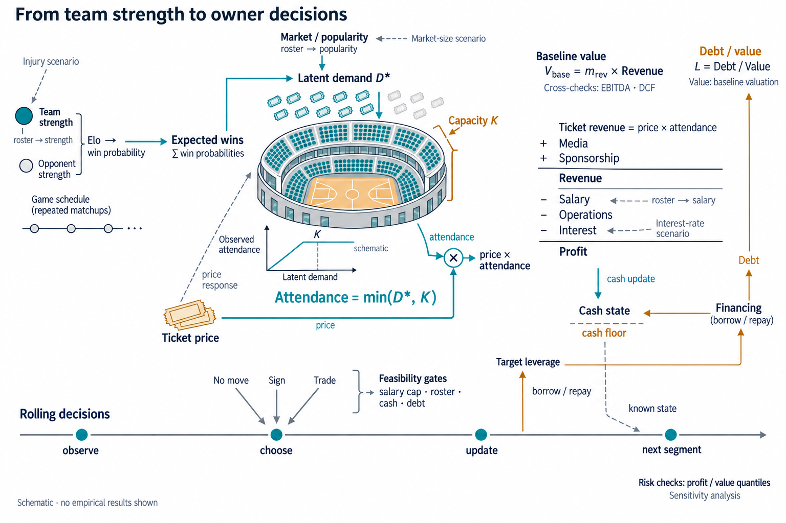

<h1 align="center">SIVIA ModelAtlas</h1>

<p align="center">Turn MCM/ICM papers into overview figures</p>

<p align="center">
  <a href="README.md">中文</a> · English<br>
  <a href="#showcase">Examples</a> ·
  <a href="#quick-start">Quick Start</a> ·
  <a href="#library">Reference library</a> ·
  <a href="docs/USAGE.md">Documentation (中文)</a>
</p>

Start with a paper or draft. Generate an Our Work / method overview, with the full prompt and caption.
After approving the image, optionally use [Sivia](https://github.com/exsinger-hub/Sivia) to rebuild it as an editable PowerPoint figure.

<a id="showcase"></a>

## Paper → Overview

2024–2026 · 6 papers · 2 original/final pairs · 4 standalone figures. Click any image for full resolution.

[2025 E](#2025-e-forest-to-farm) · [2026 C](#2026-c-ballroom-voting) · [More figures](#generated)

### Original → ModelAtlas

<a id="category-e"></a>
<a id="2025-e-forest-to-farm"></a>

#### 2025 ICM E · From Forest to Farm

Ecology & environment · Source paper Finalist · Team 2515324

<table>
  <tr>
    <th width="50%">Authors’ original</th>
    <th width="50%">ModelAtlas · final image</th>
  </tr>
  <tr>
    <td width="50%" align="center" valign="middle">
      <a href="docs/assets/reference-overviews/2025-e-2515324-overview.jpg"></a>
    </td>
    <td width="50%" align="center" valign="middle">
      <a href="docs/examples/2025-e-paper2overview/overview.png"></a>
    </td>
  </tr>
  <tr>
    <td align="center"><sub>Figure 2 · PDF p4</sub></td>
    <td align="center"><sub>Redesigned from the full paper</sub></td>
  </tr>
</table>

[Paper & caption](docs/examples/2025-e-paper2overview/README.en.md) · [Full prompt](docs/examples/2025-e-paper2overview/full-prompt.md)

<a id="category-c"></a>
<a id="2026-c-ballroom-voting"></a>

#### 2026 MCM C · Behind the Ballroom Scores

Latent-variable inference · Source paper Finalist · Team 2627351

<table>
  <tr>
    <th width="50%">Authors’ original</th>
    <th width="50%">ModelAtlas · final image</th>
  </tr>
  <tr>
    <td width="50%" align="center" valign="middle">
      <a href="docs/assets/reference-overviews/2026-c-2627351-overview.png"></a>
    </td>
    <td width="50%" align="center" valign="middle">
      <a href="docs/examples/2026-c-ballroom-voting/overview.png"></a>
    </td>
  </tr>
  <tr>
    <td align="center"><sub>Figure 1 · PDF p5</sub></td>
    <td align="center"><sub>Redesigned from the full paper</sub></td>
  </tr>
</table>

[Paper & caption](docs/examples/2026-c-ballroom-voting/README.en.md) · [Full prompt](docs/examples/2026-c-ballroom-voting/full-prompt.md)

<a id="generated"></a>

### More generated figures

<a id="category-a"></a>
<a id="2024-a-lamprey"></a>

#### 2024 MCM A · Lamprey

Ecological feedback · Source paper Outstanding Winner

<a href="docs/examples/2024-a-lamprey/overview.png"></a>

[Paper & caption](docs/examples/2024-a-lamprey/README.en.md) · [Full prompt](docs/examples/2024-a-lamprey/full-prompt.md)

<a id="category-b"></a>
<a id="2024-b-deep-sea-rescue"></a>

#### 2024 MCM B · Unlocking the Abyss

Localization & rescue · Source paper Outstanding Winner

<a href="docs/examples/2024-b-deep-sea-rescue/overview.png"></a>

[Paper & caption](docs/examples/2024-b-deep-sea-rescue/README.en.md) · [Full prompt](docs/examples/2024-b-deep-sea-rescue/full-prompt.md)

<a id="category-f"></a>
<a id="2025-f-cyber-policy"></a>

#### 2025 ICM F · Cracking the Cyber-Puzzle

Policy evaluation · Source paper Outstanding Winner

<a href="docs/examples/2025-f-cyber-policy/overview.png"></a>

[Paper & caption](docs/examples/2025-f-cyber-policy/README.en.md) · [Full prompt](docs/examples/2025-f-cyber-policy/full-prompt.md)

<a id="category-d"></a>
<a id="2026-d-wins-to-worth"></a>

#### 2026 ICM D · From Wins to Worth

Operations & decisions · Source paper Finalist

<a href="docs/examples/2026-d-wins-to-worth/overview.png"></a>

[Paper & caption](docs/examples/2026-d-wins-to-worth/README.en.md) · [Full prompt](docs/examples/2026-d-wins-to-worth/full-prompt.md)

Awards belong to the source papers. Generated figures are method illustrations, not rerun results. [Original-image credits & licenses](docs/assets/reference-overviews/README.md).

<a id="quick-start"></a>
<a id="setup"></a>

## Quick Start

Requires Python 3.10+ and a host that can read local files and call ImageGen. Viewing reference PDF pages also requires [Poppler](docs/USAGE.md).

**1. Clone and install**

```powershell
git clone https://github.com/exsinger-hub/sivia-ModelAtlas.git
cd sivia-ModelAtlas
python -m venv .venv
.\.venv\Scripts\python.exe -m pip install -e ".[mcp]"
```

<details>
<summary>macOS / Linux</summary>

```sh
git clone https://github.com/exsinger-hub/sivia-ModelAtlas.git
cd sivia-ModelAtlas
python3 -m venv .venv
.venv/bin/python -m pip install -e '.[mcp]'
```

</details>

**2. Open the project in your host, attach a paper, and send:**

```text
Follow plugins/sivia-modelatlas/skills/paper2overview/SKILL.md
to create an English overview figure for this MCM/ICM paper.
Use concrete objects and model operations from the library; avoid interchangeable module cards.
Verify formulas and arrow endpoints, check the exact full prompt, then generate and inspect the image.
Deliver the image, full prompt and caption.
```

**3. Review and revise.** For example: “Enlarge the core model, reduce the text, and keep the current reading order.”

**4. Rebuild as an editable PowerPoint figure (optional)**

After approving the image, continue with [Sivia](https://github.com/exsinger-hub/Sivia).
Install Sivia separately; this step requires Node.js and an available PowerPoint / WPS backend.
Installing ModelAtlas alone does not provide this capability. Attach the approved image and send:

```text
Use Sivia to faithfully rebuild this approved overview as an editable PPTX.
Target: PowerPoint. Create overview-editable.pptx, preserving the image’s aspect ratio and layout.
Use native editable objects for text, equations, shapes and arrows.
Keep complex artwork as separate images, with editable labels.
Work in the background without changing other presentations. Check editability, text overflow and connectors.
Deliver the PPTX and an exported preview; identify any elements that remain raster images.
```

For WPS, change the target to “WPS Presentation.” This step rebuilds individual objects, rather than embedding the entire PNG as a slide.
[Dependencies & delivery checks (中文)](docs/USAGE.md#editable-ppt)

Image generation runs in the host. The CLI only prepares the paper and references.
[MCP configuration & commands (中文)](docs/USAGE.md)

<a id="library"></a>

## Reference library

Search by problem A–F and year: 26 O/F papers with 36 figure cases, plus 3 research papers with 4 additional cases.
[Figure catalog](knowledge-base/CATALOG.md) · [Sources & year coverage](knowledge-base/SOURCES.md) · [Search & inclusion criteria (中文)](knowledge-base/README.md) · [Scene grammar](plugins/sivia-modelatlas/skills/paper2overview/references/scene-grammar.md)

---

[Documentation (中文)](docs/USAGE.md) · [Figure guidelines](plugins/sivia-modelatlas/skills/paper2overview/references/production-contract.md) ·
[Showcase index](docs/examples/showcase.json) · [Changelog](docs/CHANGELOG.md) · [MIT License](LICENSE)

Based on [Sivia](https://github.com/exsinger-hub/Sivia). Third-party papers and figures retain their respective copyrights.
