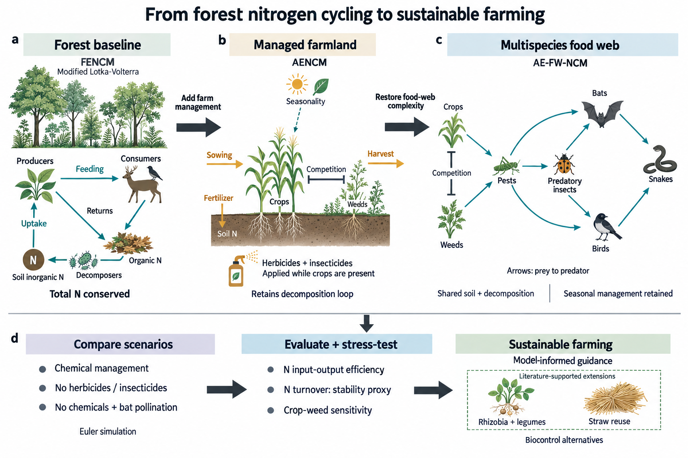

<h1 align="center">SIVIA ModelAtlas</h1>

<p align="center">为美赛论文生成 Overview</p>

<p align="center">
  中文 · <a href="README.en.md">English</a><br>
  <a href="#showcase">成图对比</a> ·
  <a href="#quick-start">Quick Start</a> ·
  <a href="#library">知识库</a> ·
  <a href="docs/USAGE.md">使用文档</a>
</p>

输入已有论文或草稿，生成 Our Work / 方法总览图，保留完整 prompt 与图注。
确认成图后，可接续 [Sivia](https://github.com/exsinger-hub/Sivia) 制作可编辑 PPT。

<a id="showcase"></a>

## 成图对比

按题号、年份、论文和生成轮次归档。点击图片查看高清版本。

[E · 生态与环境](#category-e) · 2025 · 1 篇论文 · 2 轮成图

<a id="category-e"></a>

### E · 生态与环境 / 2025

<a id="2025-e-forest-to-farm"></a>

**From Forest to Farm** · 2025 ICM E · 来源论文 Finalist · Team 2515324

<table>
  <tr>
    <th width="50%">获奖论文原图</th>
    <th width="50%">ModelAtlas · 第 2 轮 / 当前版</th>
  </tr>
  <tr>
    <td width="50%" align="center" valign="middle">
      <a href="docs/assets/reference-overviews/2025-e-2515324-overview.jpg"></a>
    </td>
    <td width="50%" align="center" valign="middle">
      <a href="docs/examples/2025-e-paper2overview/overview.png"></a>
    </td>
  </tr>
  <tr>
    <td align="center"><sub>Figure 2 · PDF p4 · 作者原图</sub></td>
    <td align="center"><sub>阅读全文后重新设计 · PNG 1536 × 1024</sub></td>
  </tr>
</table>

#### 两轮生成对比

<table>
  <tr>
    <th width="50%">第 1 轮 · 初稿</th>
    <th width="50%">第 2 轮 · 修订</th>
  </tr>
  <tr>
    <td width="50%" align="center" valign="middle">
      <a href="docs/examples/2025-e-paper2overview/overview-v1.png"></a>
    </td>
    <td width="50%" align="center" valign="middle">
      <a href="docs/examples/2025-e-paper2overview/overview.png"></a>
    </td>
  </tr>
  <tr>
    <td align="center"><sub>森林 → 农田 → 食物网</sub><br><a href="docs/examples/2025-e-paper2overview/prompt.md">第 1 轮 prompt</a></td>
    <td align="center"><sub>收获箭头从作物引出；分析区接续食物网</sub><br><a href="docs/examples/2025-e-paper2overview/correction-prompt.md">第 2 轮 prompt</a></td>
  </tr>
</table>

[当前版高清](docs/examples/2025-e-paper2overview/overview.png) ·
[完整 prompt](docs/examples/2025-e-paper2overview/full-prompt.md) ·
[论文与制作记录](docs/examples/2025-e-paper2overview/README.md) ·
[原图与许可](docs/assets/reference-overviews/README.md)

奖项属于来源论文。生成图是重设计示例，印刷尺寸检查与用户验收待完成。

<a id="quick-start"></a>
<a id="setup"></a>

## Quick Start

需要 Python 3.10+，以及能读取本地文件、调用 ImageGen 的宿主。参考图页的读取另需 [Poppler](docs/USAGE.md)。

**1. 下载并安装**

```powershell
git clone https://github.com/exsinger-hub/sivia-ModelAtlas.git
cd sivia-ModelAtlas
python -m venv .venv
.\.venv\Scripts\python.exe -m pip install -e ".[mcp]"
```

<details>
<summary>macOS / Linux</summary>

```sh
git clone https://github.com/exsinger-hub/sivia-ModelAtlas.git
cd sivia-ModelAtlas
python3 -m venv .venv
.venv/bin/python -m pip install -e '.[mcp]'
```

</details>

**2. 在宿主中打开项目，附上论文，发送：**

```text
请按 plugins/sivia-modelatlas/skills/paper2overview/SKILL.md 的流程，
为这篇美赛论文生成一张英文 Overview。
参考同类题的知识库插图，核对模型关系和箭头。
交付图片、完整 prompt 和图注。
```

**3. 查看成图，提出修改意见。** 例如：“放大核心模型，减少文字，保留目前的阅读顺序。”

**4. 转为可编辑 PPT 矢量图（可选）**

确认图片后，接续 [Sivia](https://github.com/exsinger-hub/Sivia) 的 PPT 复刻流程。
需另行安装 Sivia，并具备 Node.js 和可用的 PowerPoint / WPS 后端；仅安装 ModelAtlas 不包含此能力。
附上确认稿，发送：

```text
使用 Sivia，将这张已确认的 Overview 忠实复刻为可编辑 PPTX。
目标软件：PowerPoint；新建 overview-editable.pptx，保持原图比例与布局。
文字、公式、框图和箭头使用原生可编辑对象；复杂插画单独保留为图片，标注分离。
在后台执行，不改动其他演示文稿。检查对象可编辑性、文字溢出和连线，导出预览核对。
交付 PPTX 和预览图，并说明保留为位图的部分。
```

使用 WPS 时，将目标软件改为“WPS 演示”。这里的转换是逐对象重建，不是把整张 PNG 放进 PPT。
[依赖与交付检查](docs/USAGE.md#editable-ppt)

这条流程由宿主完成生图；单独运行 CLI 只会准备论文与参考资料。[MCP 配置与命令说明](docs/USAGE.md)

<a id="library"></a>

## 插图知识库

按 A–F 与年份检索：26 篇 O/F 论文、36 个图例；另有 3 篇科研论文、4 个扩展图例。
[图例目录](knowledge-base/CATALOG.md) · [来源与年份覆盖](knowledge-base/SOURCES.md) · [检索与入库说明](knowledge-base/README.md)

---

[使用文档](docs/USAGE.md) · [绘图规范](plugins/sivia-modelatlas/skills/paper2overview/references/production-contract.md) ·
[成图索引](docs/examples/showcase.json) · [变更记录](docs/CHANGELOG.md) · [MIT License](LICENSE)

基于 [Sivia](https://github.com/exsinger-hub/Sivia)。第三方论文与插图保留各自版权。
