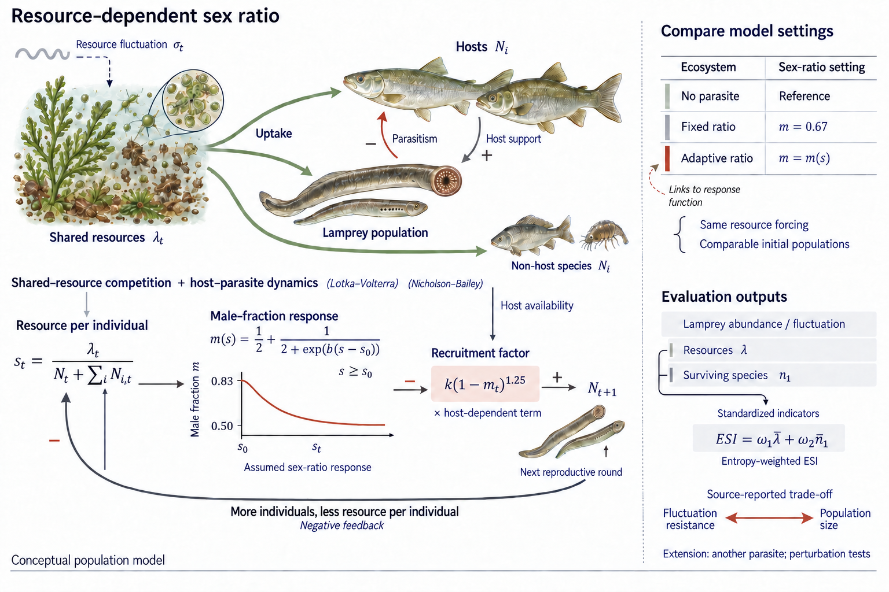

# 02 · Lamprey: a Vivid Example of the Doctrine of the Mean

2024 MCM A · Outstanding Winner · Team 2405424

Shared resources, hosts and lampreys form the main scene; resource, sex-ratio and recruitment feedback unfolds below.

[Source paper](https://raw.githubusercontent.com/yangchunwanwusheng/MCM-ICM--2024-/ffea7fd98c1fbf7d25edcba4dbc834631e9adbf2/2024/A/student%20paper/2405424.pdf) · [Award record](https://www.contest.comap.com/undergraduate/contests/mcm/contests/2024/results/) · [Full prompt](full-prompt.md) · [Exact calls](scene-prompt-records.json) · [Evidence and review](brief.json) · [中文](README.md)

## Caption

Shared-resource competition and host–parasite dynamics are coupled to a resource-dependent male fraction and recruitment feedback. Alternative sex-ratio settings are compared after simulation.

2026-09-21 · Selected as figures 01–04 and locally corrected for the project showcase. The actual raster was inspected; no empirical rerun, physical print proof or independent final review is claimed. Generated figures are not being admitted to the knowledge base.
