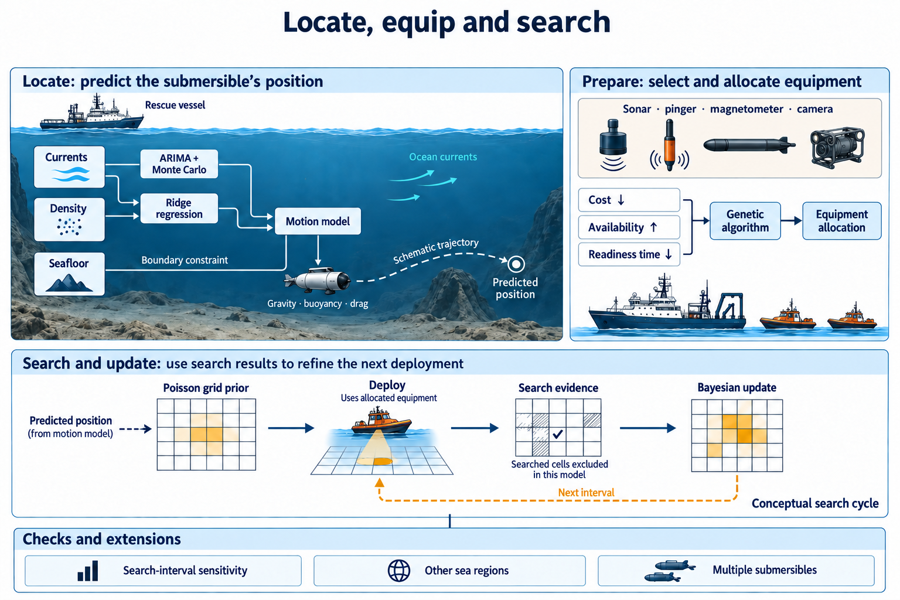

# Unlocking the Abyss · 2024 MCM B

[中文](README.md) · [All examples](../../../README.en.md#showcase)

Source paper：*Unlocking the Abyss: A Dynamical Model for Deep-Sea Adventure Safety and Rescue Strategies* · Outstanding Winner · Team 2407038.

Position prediction, equipment allocation and an updating search strategy.

[Full prompt](full-prompt.md) · [Evidence & caption](brief.json) · [File integrity](integrity-audit.json)

## Source

- [Pinned paper](https://raw.githubusercontent.com/yangchunwanwusheng/MCM-ICM--2024-/ffea7fd98c1fbf7d25edcba4dbc834631e9adbf2/2024/B/student%20paper/2407038.pdf) · [Source repository](https://github.com/yangchunwanwusheng/MCM-ICM--2024-/tree/ffea7fd98c1fbf7d25edcba4dbc834631e9adbf2).
- [Official COMAP award](https://www.contest.comap.com/undergraduate/contests/mcm/contests/2024/results/): MCM Outstanding Winners, Problem B, Team 2407038.
- PDF SHA-256: `3532e6cb77e04f698b6b54ca76045961bfce18ff9dc4539e2a2af195c43eaa84`.

The complete 25-page paper and its original overview were read. The images are new ImageGen illustrations, not screenshots or simulation reruns. Awards belong to the source papers, not to these redesigns.

## Figure scope

| Figure content | Physical PDF pages / section |
| --- | --- |
| Currents, density and seafloor support ARIMA/Monte Carlo forecasting, ridge spatial fields and a constrained Newtonian motion model. | PDF p6, §4; pp7–11, §5 |
| Genetic multi-objective equipment selection minimizes cost/readiness time and maximizes availability. | PDF pp12–16, §6 |
| Poisson-based grid prior follows predicted position; deploy, search and update probabilities using the paper's Bayesian model. | PDF pp16–20, §7 |
| Extensions to other sea areas and multiple independent submersibles; search-interval sensitivity. | PDF pp20–21, §8; p22, §9 |

## Review

The final 1536 × 1024 PNG was visually checked for labels, model boundaries and connector directions. Full prompts, actual generation/edit calls, image hashes and content notes are retained in the linked records. Only the selected final image is displayed here.

Physical print-size proof, independent review and user approval remain pending. The output is raster, not natively editable. Suggested placement: Our Work, full text width. The English caption is in `brief.json`.
