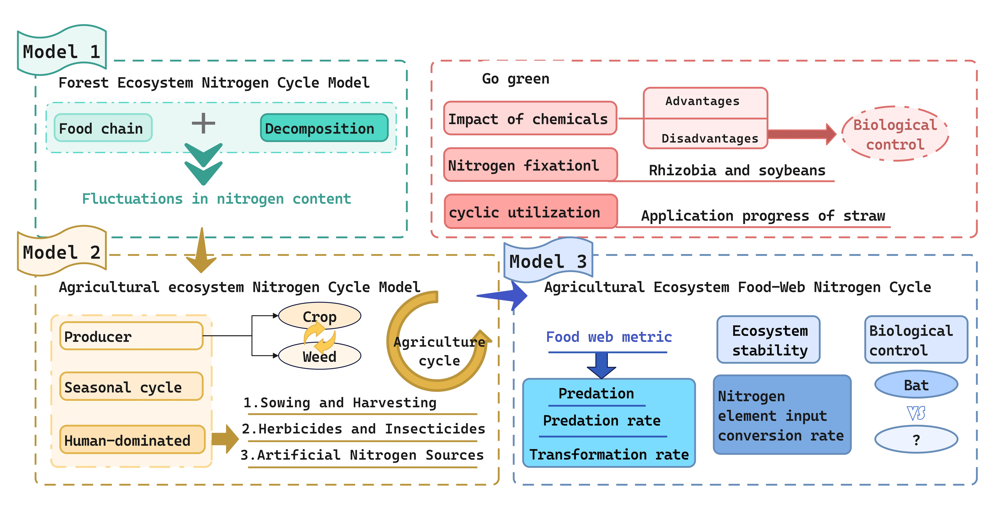
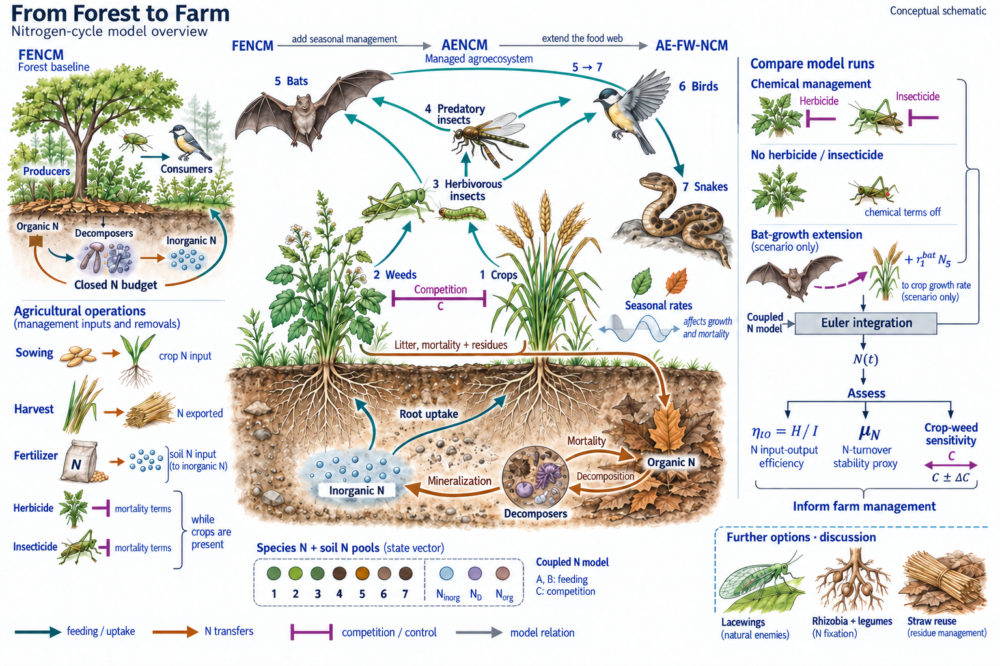

# From Forest to Farm · 2025 ICM E

[中文](README.md) · [All examples](../../../README.en.md#showcase)

Forest nitrogen cycling → agricultural management → a seven-group food web. Crops, roots and soil pools form the main scene; model scenarios and discussion-only options remain separate.

## Original and current redesign

| Authors’ original · Figure 2, PDF p4 | ModelAtlas · scene-based overview |
| :---: | :---: |
|  |  |

[Full prompt history](full-prompt.md) · [Evidence & caption](brief.json) · [File integrity](integrity-audit.json)

## Source and design

*From Forest to Farm: Modeling Nitrogen Dynamics for Sustainable Agriculture*. 2025 ICM E, Team 2515324, Finalist.

[Author repository](https://github.com/LUKEQ420/MCM-ICM-2025-E-Nitrogen-Cycling-Model) · [Pinned paper](https://github.com/LUKEQ420/MCM-ICM-2025-E-Nitrogen-Cycling-Model/blob/fb579acd7107706e055c8a10f921f9f56498a06a/paper/2515324.pdf) · [COMAP results](https://www.contest.comap.com/undergraduate/contests/mcm/contests/2025/results/2025_ICM_Problem_E_Results.pdf), physical page 6.

All 25 pages were reread; rendered pages 4, 6, 7, 13, 16, 17, 18, 21 and 23 were inspected. Sivia informed object detail and local operations, not the scientific mechanisms. The full design prompt contains 31,816 characters, followed by two local edits.

This is a known-paper redesign, not a held-out benchmark or simulation rerun. Rhizobia, lacewings and straw reuse remain discussion options. Source notation conflicts and page-level evidence are recorded in the brief. Source PDFs and page renders are not published.

## Display approval and remaining issues

On **2026-09-21**, the user approved the image and GitHub publication: “这个很不错,可以推送”. This is project-showcase approval, not scientific validation. Visual review remains `needs_revision`; the image is not admitted to the source reference library.

- The bat-to-snake route passes close to the bird; the independent bird-to-snake edge is ambiguous.
- The fertilizer crop-presence brace is disconnected from the pesticide rows.
- Local color semantics in the forest inset need unifying. Grass glyphs are scenery, not extra states.

The actual output is a **1536 × 1024 PNG**, not native editable vectors. Independent review and print-size proof were not performed. This is not labeled publication-ready; file integrity does not establish scientific or visual validity.

## Records

Only the current image appears in the showcase. Historical outputs remain as [initial](overview-v1.png), [previous](overview-v2.png), [scene draft](overview-scene-v1.png) and [first scene edit](overview-scene-v2.png).

The [complete history](full-prompt.md) preserves all five calls. [Exact submitted text](scene-prompt-records.json) and [template check](scene-prompt-check.json) cover the new three-call series. The [historical brief](brief-before-scene.json) preserves the old record; see [brief.json](brief.json) for the current caption and review.

Awards and scientific claims belong to the paper’s authors; this example does not imply their endorsement. [Original-image credits & MIT license](../../assets/reference-overviews/README.md).
