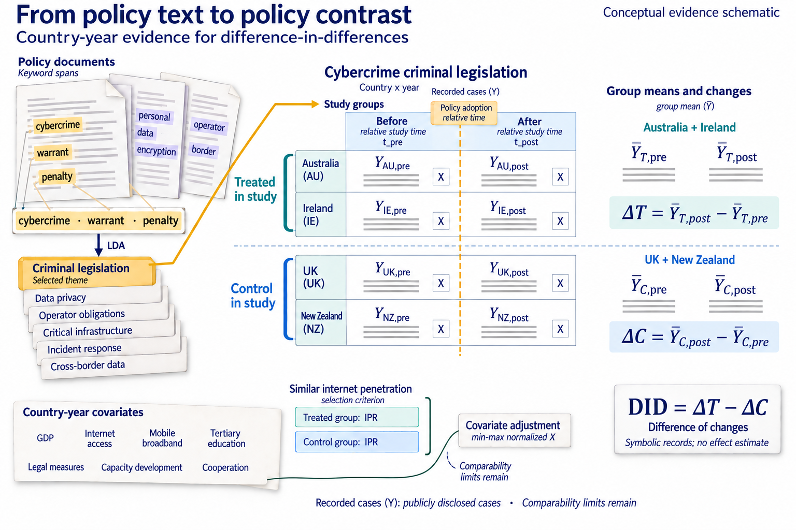

# 04 · Cracking the Cyber-Puzzle: KDMF in Action

2025 ICM F · Outstanding Winner · Team 2513705

Policy text leads to country-year records and the treated/control changes that form a difference-in-differences contrast.

[Source paper](https://raw.githubusercontent.com/Jackksonns/MCM-ICM-Outstanding-Papers/d29267cb9e993419749e6111981b30a44183fdf8/2025/F/2513705.pdf) · [Award record](https://www.contest.comap.com/undergraduate/contests/mcm/contests/2025/results/) · [Full prompt](full-prompt.md) · [Exact calls](scene-prompt-records.json) · [Evidence and review](brief.json) · [中文](README.md)

## Caption

Conceptual policy-evaluation mechanism for cybercrime criminal legislation. Paper-listed policy keywords identify a theme whose reported treated group (Australia and Ireland) and control group (UK and New Zealand) are followed before and after a relative adoption boundary. The register exposes the symbolic difference of within-group changes, with internet-penetration comparability and covariate adjustment shown as supporting study context. Records are schematic; no effect estimate or policy-efficacy conclusion is reproduced.

2026-09-21 · Selected as figures 01–04 and locally corrected for the project showcase. The actual raster was inspected; no empirical rerun, physical print proof or independent final review is claimed. Generated figures are not being admitted to the knowledge base.
