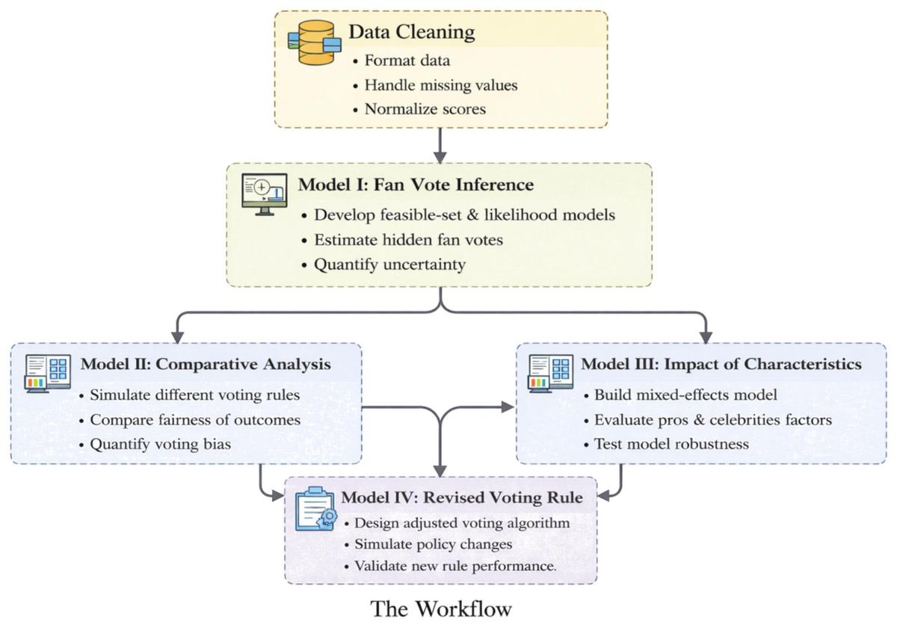
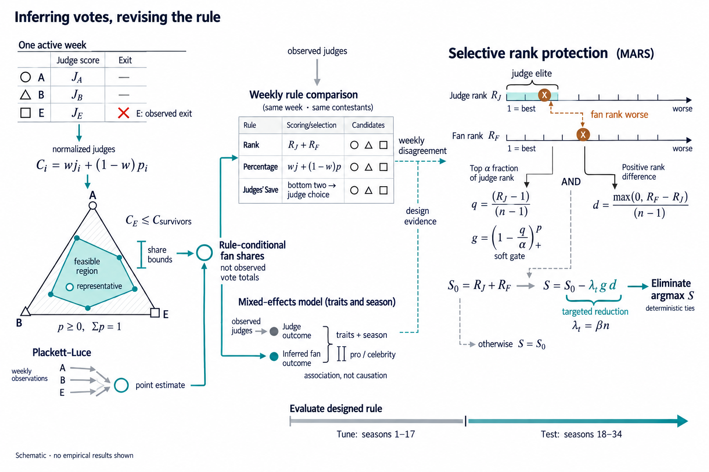

# Behind the Ballroom Scores · 2026 MCM C

[中文](README.md) · [All examples](../../../README.en.md#showcase)

Source paper：*Behind the Ballroom Scores: Reconstructing Fan Voting and Designing Fairer Rules for DWTS* · Finalist · Team 2627351.

| Authors’ original · Figure 1, PDF p5 | ModelAtlas · final image |
| :---: | :---: |
|  |  |

A feasible-share domain, matched weekly rules and an enlarged conditional rank correction replace the repeated panels.

[Full prompt](full-prompt.md) · [Evidence & caption](brief.json) · [File integrity](integrity-audit.json)

## Source

- [Pinned paper](https://raw.githubusercontent.com/alectimison-maker/2026MCM-ICM_C/2fcf7bb344e6fa7c295ec771b5be79c3a9ebd361/2627351_submitted_paper.pdf) · [Source repository](https://github.com/alectimison-maker/2026MCM-ICM_C).
- [Official COMAP award](https://www.contest.comap.com/undergraduate/contests/mcm/contests/2026/results/2026_MCM_Problem_C_Results.pdf): PDF page 15, Team 2627351, C, Finalist.
- PDF SHA-256: `ab837f28944fce38f7677fe833ed89360ff38da754e47f7f406273dfae31bf55`.

The complete 34-page paper and its original overview were read. The images are new ImageGen illustrations, not screenshots or simulation reruns. Awards belong to the source papers, not to these redesigns.

The original author figure retains its [MIT attribution](../../assets/reference-overviews/README.md).

## Figure scope

| Figure content | Physical PDF pages / section |
| --- | --- |
| Cleaning observed judge scores, eliminations and contestant metadata; latent fan support is a relative share, not observed vote totals. | PDF pp4–6, §§1–3 |
| Complementary feasible-set intervals and Plackett–Luce point inference with consistency and uncertainty diagnostics. | PDF pp7–10, §4 |
| Same-week contestant-set counterfactuals for Rank, Percentage and Judges' Save, with cross-inference checks. | PDF pp11–14, §5 |
| Mixed-effects models compare judge and inferred-fan outcomes with trait/season effects and pro/celebrity intercepts. | PDF pp14–18, §6 |
| MARS-Soft+Disagreement modifies rank-sum risk only for judge-elite contestants with weaker fan rank; earlier/later season tuning/test split. | PDF pp18–20, §7 |
| Inference sensitivity and season-blocked trait-model validation. | PDF pp21–22, §8 |

## Review

The final 1536 × 1024 PNG was visually checked for labels, model boundaries and connector directions. Full prompts, actual generation/edit calls, image hashes and content notes are retained in the linked records. Only the selected final image is displayed here.

Physical print-size proof, independent review and user approval remain pending. The output is raster, not natively editable. Suggested placement: Our Work, full text width. The English caption is in `brief.json`.
